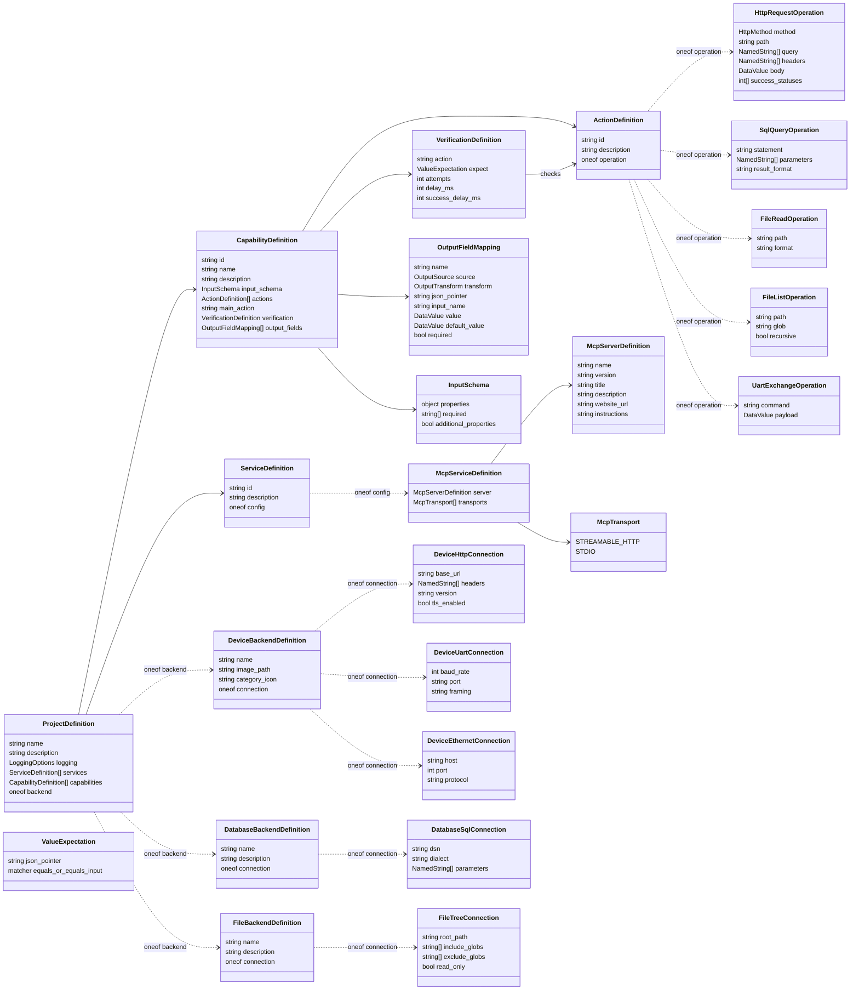

# Proposed Terva Project Schema Diagram

This diagram reflects the current proposed breaking-direction for the `.terva` schema.

```mermaid
classDiagram
  direction LR

  class ProjectDefinition {
    string name
    string description
    LoggingOptions logging
    ServiceDefinition[] services
    CapabilityDefinition[] capabilities
    oneof backend
  }

  class ServiceDefinition {
    string id
    string description
    oneof config
  }

  class McpServiceDefinition {
    McpServerDefinition server
    McpTransport[] transports
  }

  class McpServerDefinition {
    string name
    string version
    string title
    string description
    string website_url
    string instructions
  }

  class DeviceBackendDefinition {
    string name
    string image_path
    string category_icon
    oneof connection
  }

  class DatabaseBackendDefinition {
    string name
    string description
    oneof connection
  }

  class FileBackendDefinition {
    string name
    string description
    oneof connection
  }

  class DeviceHttpConnection {
    string base_url
    NamedString[] headers
    string version
    bool tls_enabled
  }

  class DeviceUartConnection {
    int baud_rate
    string port
    string framing
  }

  class DeviceEthernetConnection {
    string host
    int port
    string protocol
  }

  class DatabaseSqlConnection {
    string dsn
    string dialect
    NamedString[] parameters
  }

  class FileTreeConnection {
    string root_path
    string[] include_globs
    string[] exclude_globs
    bool read_only
  }

  class CapabilityDefinition {
    string id
    string name
    string description
    InputSchema input_schema
    ActionDefinition[] actions
    string main_action
    VerificationDefinition verification
    OutputFieldMapping[] output_fields
  }

  class ActionDefinition {
    string id
    string description
    oneof operation
  }

  class HttpRequestOperation {
    HttpMethod method
    string path
    NamedString[] query
    NamedString[] headers
    DataValue body
    int[] success_statuses
  }

  class SqlQueryOperation {
    string statement
    NamedString[] parameters
    string result_format
  }

  class FileReadOperation {
    string path
    string format
  }

  class FileListOperation {
    string path
    string glob
    bool recursive
  }

  class UartExchangeOperation {
    string command
    DataValue payload
  }

  class InputSchema {
    object properties
    string[] required
    bool additional_properties
  }

  class VerificationDefinition {
    string action
    ValueExpectation expect
    int attempts
    int delay_ms
    int success_delay_ms
  }

  class OutputFieldMapping {
    string name
    OutputSource source
    OutputTransform transform
    string json_pointer
    string input_name
    DataValue value
    DataValue default_value
    bool required
  }

  class ValueExpectation {
    string json_pointer
    matcher equals_or_equals_input
  }

  class McpTransport {
    STREAMABLE_HTTP
    STDIO
  }

  ProjectDefinition --> CapabilityDefinition
  ProjectDefinition --> ServiceDefinition
  ProjectDefinition ..> DeviceBackendDefinition : oneof backend
  ProjectDefinition ..> DatabaseBackendDefinition : oneof backend
  ProjectDefinition ..> FileBackendDefinition : oneof backend

  ServiceDefinition ..> McpServiceDefinition : oneof config
  McpServiceDefinition --> McpServerDefinition
  McpServiceDefinition --> McpTransport

  DeviceBackendDefinition ..> DeviceHttpConnection : oneof connection
  DeviceBackendDefinition ..> DeviceUartConnection : oneof connection
  DeviceBackendDefinition ..> DeviceEthernetConnection : oneof connection
  DatabaseBackendDefinition ..> DatabaseSqlConnection : oneof connection
  FileBackendDefinition ..> FileTreeConnection : oneof connection

  CapabilityDefinition --> ActionDefinition
  CapabilityDefinition --> VerificationDefinition
  CapabilityDefinition --> OutputFieldMapping
  CapabilityDefinition --> InputSchema

  VerificationDefinition --> ActionDefinition : checks

  ActionDefinition ..> HttpRequestOperation : oneof operation
  ActionDefinition ..> SqlQueryOperation : oneof operation
  ActionDefinition ..> FileReadOperation : oneof operation
  ActionDefinition ..> FileListOperation : oneof operation
  ActionDefinition ..> UartExchangeOperation : oneof operation
```
